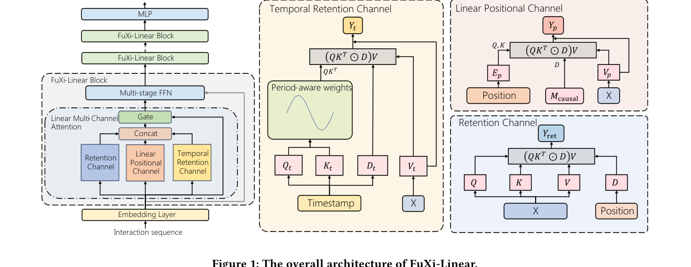

# FuXi-Linear: Unleashing the Power of Linear Attention in Long-term Time-aware Sequential Recommendation

[](https://ustc-starteam.github.io/fuxi-linear/)
[](https://arxiv.org/abs/2602.23671)
[](https://doi.org/10.5281/zenodo.20425007)
[](https://www.python.org/)

Official PyTorch implementation for **"FuXi-Linear: Unleashing the Power of Linear Attention in Long-term Time-aware Sequential Recommendation"**.

FuXi-Linear brings linear-complexity modeling to long-term time-aware sequential recommendation. It separates semantic, temporal, and positional signals through a FuXi-Linear block with a Temporal Retention Channel and a Linear Positional Channel, enabling long-sequence experiments on KuaiRand-27K, KuaiRec, and MovieLens-20M.

## 1. Paper

Yufei Ye, Wei Guo, Hao Wang, Luankang Zhang, Heng Chang, Hong Zhu, Yuyang Ye, Yong Liu, Defu Lian, and Enhong Chen. **FuXi-Linear: Unleashing the Power of Linear Attention in Long-term Time-aware Sequential Recommendation.** arXiv:2602.23671, 2026.

[Paper](https://arxiv.org/abs/2602.23671) / [PDF](https://arxiv.org/pdf/2602.23671) / [Project Page](https://ustc-starteam.github.io/fuxi-linear/) / [Code](https://github.com/USTC-StarTeam/fuxi-linear) / [Citation](#citation)

The paper argues that conventional attention-based recommenders struggle with thousand-length user sequences because of quadratic cost and coupled temporal/semantic signals. FuXi-Linear introduces temporal retention and linear positional modeling to retain recommendation quality while improving long-sequence efficiency.

## 2. Highlights

- Uses a **Temporal Retention Channel** to capture period-aware temporal information without mixing it directly with semantic attention.
- Adds a **Linear Positional Channel** to restore positional signals under linear attention.
- Supports long time-aware sequential recommendation experiments with public preprocessing scripts.
- Reports efficient long-sequence inference with competitive recommendation quality.

## 3. Method At A Glance



The FuXi-Linear block combines retention, linear positional, and temporal retention channels before the multi-stage feed-forward network. This design keeps linear complexity while making timestamp and position information explicit.

## 4. Repository Structure

```text
.
|-- configs/                         # Gin configs for KuaiRand-27K, KuaiRec, and MovieLens-20M
|-- generative_recommenders/         # Sequential recommendation model components
|-- preprocess_*.py                  # Dataset preprocessing scripts
|-- main.py                          # Main training entry point
|-- requirements.txt                 # Runtime dependencies
`-- docs/                            # Project page and README assets
```

## 5. Installation

Install PyTorch for your CUDA environment first, then install the remaining dependencies:

```bash
pip3 install gin-config absl-py scikit-learn scipy matplotlib numpy apex hypothesis pandas fbgemm_gpu iopath
```

## 6. Data / Models

Create a local `tmp/` directory and download the public datasets:

- [KuaiRand](https://kuairand.com/)
- [KuaiRec](https://kuairec.com/)
- MovieLens-20M, downloaded by the preprocessing script

Expected local layout:

```text
tmp/
|-- kuairand-27k/
`-- kuairec/
```

## 7. Quick Start

Preprocess public datasets:

```bash
python3 preprocess_public_data.py
python3 preprocess_kuairand27k_data.py
python3 preprocess_kuairec_data.py
```

Run a KuaiRand-27K experiment:

```bash
CUDA_VISIBLE_DEVICES=0,1 python3 main.py \
  --gin_config_file=configs/kuairand-27k/linear-4b-l1024-b64x2.gin \
  --master_port=12345
```

## 8. Reproducing Results / Evaluation

Experiment configurations are organized under:

- `configs/kuairand-27k/`
- `configs/kuairec/`
- `configs/ml-20m/`

Training logs are written to `exps/` by default. You can inspect them with TensorBoard:

```bash
tensorboard --logdir ./exps/kuairand-27k-l1024/ --port 24001 --bind_all
```

## 9. Configuration Notes

The included Gin files cover several model families and sequence-length settings. Start from the dataset-specific `linear-*.gin` files when reproducing FuXi-Linear, then compare against the HSTU, Mamba, SASRec, TiM4Rec, and TTT configurations included in the same folders.

## 10. Experimental Highlights

The reported experiments focus on long user histories where efficient attention matters most. FuXi-Linear is designed to preserve the expressive benefits of sequence modeling while reducing prefill and decoding costs in thousand-length recommendation settings.

## 11. Notes For Maintainers

- Keep dataset files and training artifacts out of Git history.
- Store future README/project-page figures under `docs/assets/`.
- When proceedings or presentation links become public, add them to the Paper section and project page.

<a id="citation"></a>

## 12. Citation

```bibtex
@misc{ye2026fuxilinear,
  title = {FuXi-Linear: Unleashing the Power of Linear Attention in Long-term Time-aware Sequential Recommendation},
  author = {Ye, Yufei and Guo, Wei and Wang, Hao and Zhang, Luankang and Chang, Heng and Zhu, Hong and Ye, Yuyang and Liu, Yong and Lian, Defu and Chen, Enhong},
  year = {2026},
  eprint = {2602.23671},
  archivePrefix = {arXiv},
  primaryClass = {cs.IR},
  url = {https://arxiv.org/abs/2602.23671}
}
```

## 13. Contact

For paper questions, please contact:

- First author: Yufei Ye (`aboluo2003@mail.ustc.edu.cn`)
- Corresponding authors: Hao Wang (`wanghao3@ustc.edu.cn`) and Enhong Chen (`cheneh@ustc.edu.cn`)

For repository issues, please open a GitHub issue in this repository.
